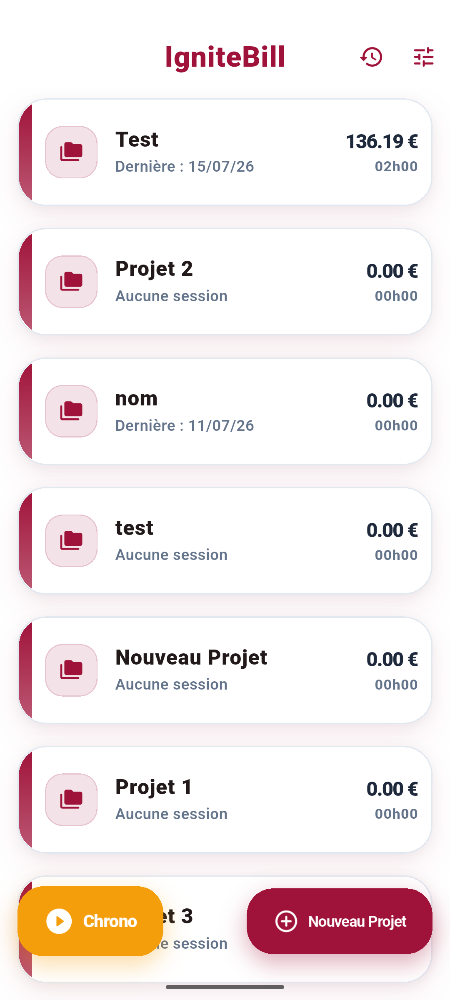
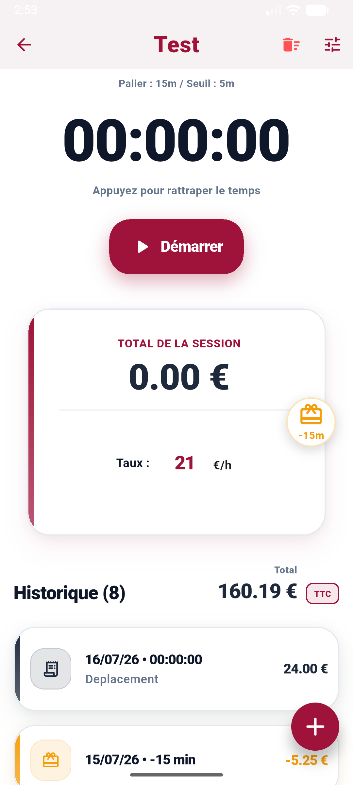
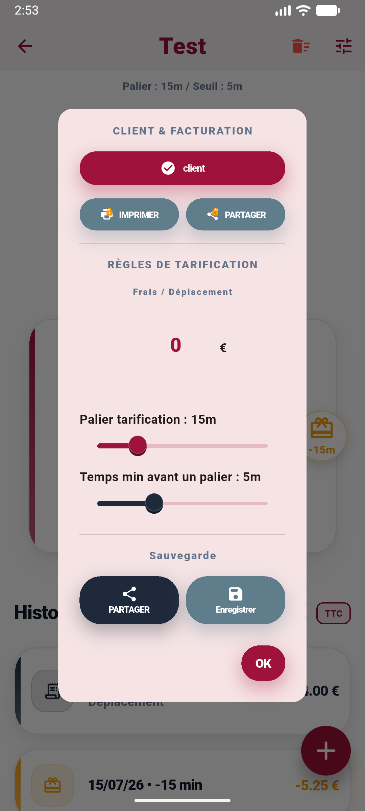
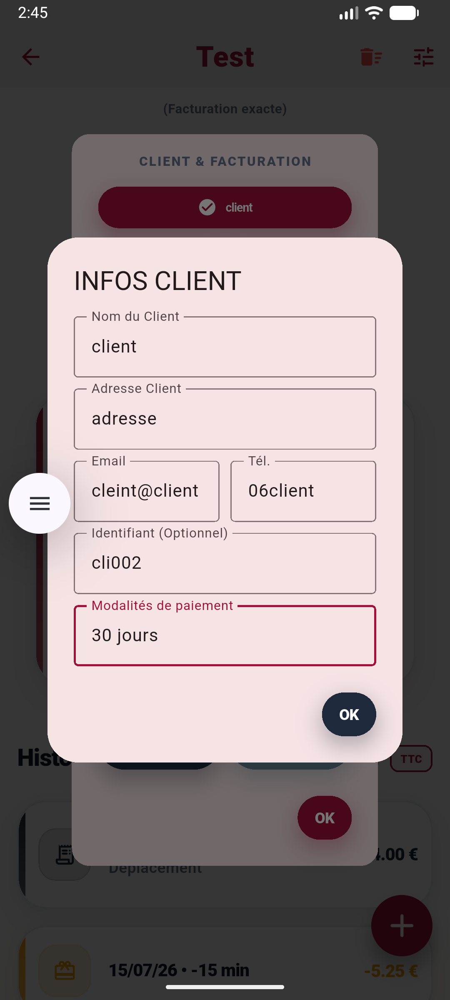
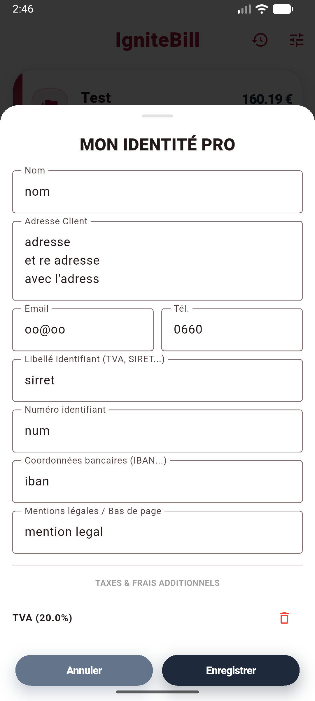

# IgniteBill

IgniteBill is a personal open-source project, built in my free time for freelancers who want to track their time and bill clients without sending their data to the cloud. Everything stays on your phone.

I created this because most billing tools are either too complex or greedy with personal data. IgniteBill is "Local First": no account, no tracking, just your data.

## Philosophy & Support

The entire application and its APK are **100% open-source and free**.
To support the project and thank me for the time spent developing it, you can purchase **custom skins (themes)** within the app. It's the only paid feature, designed for those who want to contribute to the project's existence while customizing their experience.

## What it does

*   **Real-time tracking**: A simple timer that shows exactly what you've earned as you work.
*   **Flexible pricing**: Set your hourly rate and define your own rules (e.g., billing every 15 minutes, with a minimum threshold).
*   **Expense management**: Add travel fees or fixed costs to your sessions.
*   **Client & Pro Profile**: Save your business info (VAT, SIRET, IBAN) and your clients' details.
*   **PDF Export**: Generate clean, professional invoices ready to be sent.
*   **History**: A clear view of all your past sessions and totals.

## Screenshots

| Project List | Active Session | Pricing Rules |
|:---:|:---:|:---:|
|  |  |  |

| Client Setup | Pro Identity |
|:---:|:---:|
|  |  |

## Quick Workflow

1.  **Configure**: Fill in your business info in the settings.
2.  **Create**: Add a project and a client. Set your rates.
3.  **Track**: Hit start. Use the "catch up" feature if you started late.
4.  **Send**: Generate the PDF or share the summary directly.

## Contributing

If you find a bug or want a new feature, feel free to open an issue or a PR.

---
[Support the project on Ko-fi](https://ko-fi.com/dthrawn) ☕
